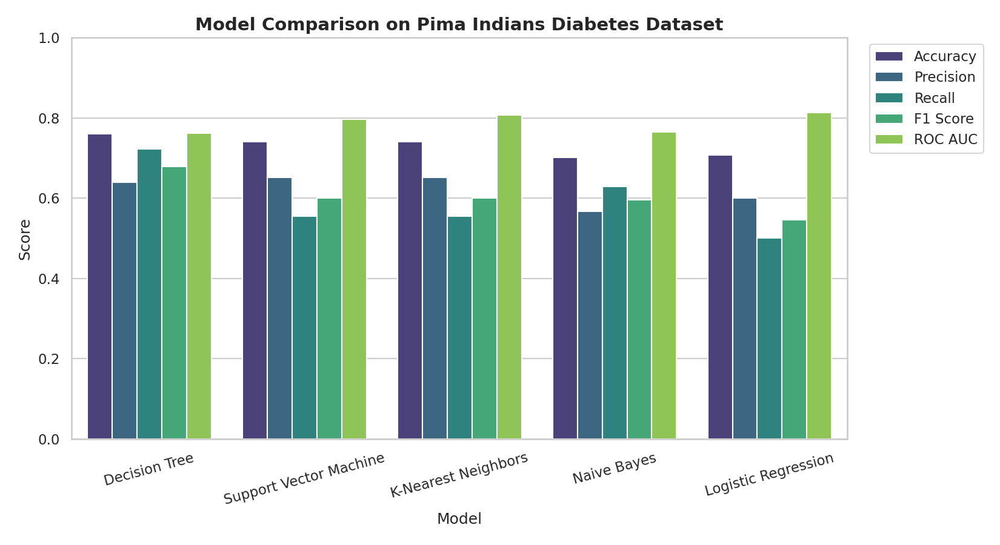

# Supervised Learning Algorithm Comparison

A head-to-head comparison of **5 supervised classification algorithms** — trained and
evaluated on the **exact same data, split, and preprocessing** — to build intuition
for which algorithm families suit which kinds of problems.

This is a follow-up to [`linear-regression-from-scratch`](https://github.com/yeshi-rnj/linear-regression-from-scratch),
moving from a single hand-built model to a fair, scikit-learn-based comparison across
five different algorithm families.

## Dataset

**[Pima Indians Diabetes Dataset](https://raw.githubusercontent.com/jbrownlee/Datasets/master/pima-indians-diabetes.data.csv)**
— 768 patient records, 8 numeric features, binary target (`Outcome`: has diabetes / does not).

This dataset was chosen deliberately over something like Iris because it is **not**
trivially separable: classes overlap heavily in feature space, several features are
noisy or only weakly predictive, and there are real missing-value artifacts to clean
up. No model gets anywhere near 100% here, and the five algorithms genuinely disagree
with each other — which is exactly what makes the comparison interesting.

| Feature | Description |
|---|---|
| Pregnancies | Number of times pregnant |
| Glucose | Plasma glucose concentration |
| BloodPressure | Diastolic blood pressure (mm Hg) |
| SkinThickness | Triceps skinfold thickness (mm) |
| Insulin | 2-hour serum insulin (mu U/ml) |
| BMI | Body mass index |
| DiabetesPedigreeFunction | Diabetes likelihood based on family history |
| Age | Age in years |
| **Outcome** | 1 = diabetic, 0 = not (target) |

Class balance: **65% negative / 35% positive** — mildly imbalanced, which is one
reason accuracy alone is a misleading metric here (see below).

## Preprocessing (identical for every model)

1. **Missing values**: `Glucose`, `BloodPressure`, `SkinThickness`, `Insulin`, and `BMI`
   use `0` as a placeholder for "not measured" in the raw data (a value of 0 mm Hg
   blood pressure is not physiologically possible). These zeros are converted to `NaN`
   and imputed with the **training-set median** for that column.
2. **No categorical columns** exist in this dataset, so no encoding step was needed —
   but the pipeline is structured so a `OneHotEncoder` step would slot in at the same
   point, fit on train only, if it did.
3. **Train/test split**: a single stratified 80/20 split (`random_state=42`) is
   created once and reused for every model — nobody trains or is evaluated on a
   different sample of the data.
4. **Scaling**: `StandardScaler` is fit on the training set only, then applied to both
   train and test. It is applied only to the models that need it — distance-based
   (KNN) and margin/gradient-based (SVM, Logistic Regression) algorithms are scale-sensitive;
   Decision Trees split on raw thresholds and are scale-invariant; Gaussian Naive Bayes
   models each feature's per-class distribution independently, so scaling doesn't
   change its decision boundary.

## Models compared

| Model | Notes |
|---|---|
| Logistic Regression | Linear decision boundary, `max_iter=1000` |
| Decision Tree | `max_depth=5` (capped to limit overfitting) |
| K-Nearest Neighbors | `n_neighbors=15` |
| Support Vector Machine | RBF kernel, `probability=True` |
| Gaussian Naive Bayes | Default parameters |

## Results

Ranked by F1 score (test set, 154 held-out samples):

| Model | Accuracy | Precision | Recall | F1 Score | ROC AUC |
|---|---|---|---|---|---|
| **Decision Tree** | 0.760 | 0.639 | 0.722 | **0.678** | 0.762 |
| Support Vector Machine | 0.740 | 0.652 | 0.556 | 0.600 | 0.796 |
| K-Nearest Neighbors | 0.740 | 0.652 | 0.556 | 0.600 | 0.807 |
| Naive Bayes | 0.701 | 0.567 | 0.630 | 0.597 | 0.765 |
| Logistic Regression | 0.708 | 0.600 | 0.500 | 0.545 | **0.813** |



Full classification reports, confusion matrices, and ROC curves are in
[`results/`](results/) and reproduced by running `compare_models.py`.

### A note on ranking metric

At the default 0.5 probability threshold, the **Decision Tree wins on F1** because it
catches the most true diabetes cases (recall 0.72) without destroying precision. But
by **ROC AUC** — which measures ranking quality across *all* thresholds, not just 0.5 —
**Logistic Regression comes out on top** (0.813 vs. 0.762). This is a useful lesson in
itself: which model "wins" depends on which metric matters for the use case. If a
clinician can tune the decision threshold, Logistic Regression's probability estimates
are the most reliable to rank patients by risk; if you need a single fixed cutoff, the
Decision Tree gives the best balance out of the box.

## Analysis: why each model performed the way it did

**🏆 Decision Tree (best F1, 0.678)**
The tree wins on F1 mainly because of **recall** — at 0.72 it catches noticeably more
diabetic patients than any other model. Tree splits can carve out non-linear,
axis-aligned regions (e.g. "if Glucose > 143 AND BMI > 29.9 AND Age > 28 → diabetic"),
which suits this dataset well: diabetes risk in this data is driven by **threshold
effects and feature interactions** (glucose and BMI compound each other's effect)
rather than a smooth linear relationship. Capping `max_depth=5` kept it from
overfitting the noisy features (`SkinThickness`, `Insulin` have heavy imputation and
weak individual signal), so it captured the real interactions without memorizing
noise. Its main weakness is instability — a single tree's exact splits are sensitive
to the training sample, which is also why its ROC AUC (a measure of ranking quality
across the whole probability range) is the *lowest* of the five: its probability
outputs are coarse step functions, not a smoothly graded risk score.

**🥈 Logistic Regression (best ROC AUC, 0.813; weakest F1, 0.545)**
Logistic Regression produces the smoothest, best-calibrated probability estimates —
hence the highest AUC — but its F1 is the worst of the five. With only a **linear**
decision boundary, it can't represent the interaction effects (glucose × BMI × age)
that the tree exploits, so at the standard 0.5 threshold it plays it conservative:
recall drops to 0.50, meaning it misses half the actual diabetic cases. This is a
classic linear-model failure mode on a dataset where the true relationship isn't
purely additive — the model isn't *wrong*, it's just under-expressive for this
decision boundary, even though it still ranks patients by risk very well overall.

**SVM (RBF kernel) and KNN (tied, F1 = 0.600)**
These two land in the middle for a related reason: both are **distance-based** and
depend entirely on the geometry of the scaled feature space. The RBF kernel and
k-NN's Euclidean distance both implicitly assume "nearby points behave similarly,"
which is a reasonable assumption here since the imputed/scaled features do form loose
local clusters — but with only ~614 training points spread across 8 dimensions, the
neighborhoods get sparse (the curse of dimensionality), so both models are systematically
conservative on recall (0.556 for both) just like Logistic Regression. Their identical
scores are a coincidence of this particular split/threshold, not a sign they're doing
the same thing — their AUCs diverge (0.796 vs 0.807), showing KNN ranks risk slightly
better once you look past the single threshold.

**Naive Bayes (weakest accuracy, 0.701)**
Naive Bayes assumes every feature is **conditionally independent given the class** —
an assumption that's clearly false here (Glucose, BMI, and Age are all correlated with
each other and jointly drive diabetes risk). Violating the independence assumption
biases its probability estimates, which is why it has the lowest accuracy and
precision (0.567) despite a decent recall (0.630) — it over-predicts the positive
class to compensate for that bias. It's also the fastest model to train by a wide
margin and needs no scaling, so despite the weakest raw scores it remains a
reasonable baseline.

## Takeaways

- **No single "best" algorithm** — the ranking flips depending on whether you
  optimize for F1 (Decision Tree) or AUC/ranking quality (Logistic Regression).
- **Tree-based models handled the non-linear feature interactions in this dataset
  best**, at the cost of coarser, less calibrated probability estimates.
- **Linear and distance-based models were held back by the same root cause**: the
  true decision boundary here isn't linear or cleanly separable in raw Euclidean
  space, so LogReg, SVM, and KNN all converge on similarly conservative recall.
- **Preprocessing consistency mattered**: because scaling/imputation used train-only
  statistics applied identically everywhere, this comparison isolates the effect of
  the *algorithm*, not accidental data leakage or preprocessing mismatches.

## Repository structure

```
.
├── compare_models.py          # full pipeline: load → clean → split → scale → train → evaluate → plot
├── diabetes.csv                # raw dataset (Pima Indians Diabetes)
├── requirements.txt
├── results/
│   ├── comparison_table.csv
│   ├── comparison_chart.png
│   ├── confusion_matrices.png
│   └── roc_curves.png
└── README.md
```

## Reproduce it

```bash
git clone <this-repo-url>
cd <this-repo>
pip install -r requirements.txt
python compare_models.py
```

## Tools

Python, pandas, scikit-learn (`LogisticRegression`, `DecisionTreeClassifier`,
`KNeighborsClassifier`, `SVC`, `GaussianNB`, `train_test_split`, `StandardScaler`,
`sklearn.metrics`), matplotlib, seaborn.
